# 🧠 LeetCode Patterns - Complete C++ Implementation

> **3300+ LeetCode problems reduce to ~40 atomic patterns + infinite disguises**

A comprehensive C++ implementation of all essential algorithm patterns, organized by category with brain-mapping correlations, real-world applications, and visual dependency graphs.

---

## 📊 Pattern Hierarchy Visualization

```mermaid
graph TB
    subgraph "🧬 PRIMITIVES (P0-P9)"
        P0[P0: Compare<br/>═══════════<br/>min, max, ==, dominates]
        P1[P1: Accumulate<br/>═══════════<br/>sum, prefix, count]
        P2[P2: Branch<br/>═══════════<br/>if/else, switch]
        P3[P3: Repeat<br/>═══════════<br/>loops, recursion]
        P4[P4: Remember<br/>═══════════<br/>memoization, cache]
        P5[P5: Forget<br/>═══════════<br/>prune, discard]
        P6[P6: Rewind<br/>═══════════<br/>backtrack, undo]
        P7[P7: Compress<br/>═══════════<br/>reduce dimensions]
        P8[P8: Expand<br/>═══════════<br/>generate neighbors]
        P9[P9: Approximate<br/>═══════════<br/>binary search answer]
    end

    subgraph "📦 CORE PATTERNS"
        A["A: Array/String<br/>(Patterns 1-6)"]
        B["B: Hashing<br/>(Patterns 7-8)"]
        C["C: Stack/Monotonic<br/>(Patterns 9-11)"]
        D["D: Sorting<br/>(Patterns 12-14)"]
        E["E: Greedy<br/>(Patterns 15-17)"]
        F["F: Binary Search<br/>(Patterns 18-20)"]
        G["G: Recursion/Backtrack<br/>(Patterns 21-23)"]
        H["H: Graph<br/>(Patterns 24-28)"]
        I["I: Dynamic Programming<br/>(Patterns 29-33)"]
        J["J: Intervals<br/>(Patterns 34-35)"]
        K["K: Advanced<br/>(Patterns 36-40)"]
    end

    P0 --> A
    P0 --> E
    P0 --> F
    P1 --> A
    P1 --> I
    P2 --> E
    P2 --> G
    P3 --> G
    P3 --> H
    P4 --> B
    P4 --> I
    P5 --> A
    P5 --> C
    P6 --> G
    P7 --> I
    P8 --> H
    P9 --> F
```



---

## 🔄 Pattern Dependency Graph


---

## 🧪 Pattern-Problem Mapping


---

## 📁 Directory Structure

```
LeetCode_Patterns_CPP/
│
├── P0_Primitives/
│   └── primitives.cpp             # P0-P9: The 10 atomic operations
│
├── A_Array_String/
│   ├── 01_linear_scan.cpp         # Pattern 1: Max, min, count, Kadane's
│   ├── 02_two_pointers.cpp        # Pattern 2: Pair sum, palindrome
│   ├── 03_sliding_window.cpp      # Pattern 3: Longest/shortest substring
│   └── 04_05_06_prefix_diff.cpp   # Patterns 4-6: Prefix sum, difference array
│
├── B_Hashing_Memory/
│   └── 07_08_hash_patterns.cpp    # Patterns 7-8: Frequency, seen state
│
├── C_Stack_Monotonic/
│   └── 09_10_11_stack_monotonic.cpp  # Patterns 9-11: Stack simulation, monotonic
│
├── D_Sorting_Ordering/
│   └── 12_13_14_sorting.cpp       # Patterns 12-14: Sort, comparator, bucket
│
├── E_Greedy/
│   └── 15_16_17_greedy.cpp        # Patterns 15-17: Choice, invariant, heap
│
├── F_Binary_Search/
│   └── 18_19_20_binary_search.cpp # Patterns 18-20: Index, answer, parametric
│
├── G_Recursion_Backtracking/
│   └── 21_22_23_recursion.cpp     # Patterns 21-23: DFS, backtrack, pruning
│
├── H_Graph/
│   └── 24_25_26_27_28_graph.cpp   # Patterns 24-28: BFS, DFS, topo, DSU, Dijkstra
│
├── I_Dynamic_Programming/
│   └── 29_30_31_32_33_dp.cpp      # Patterns 29-33: 1D, 2D, subseq, bitmask, tree
│
├── J_Interval_SweepLine/
│   └── 34_35_intervals.cpp        # Patterns 34-35: Merge, sweep line
│
└── K_Advanced/
    └── 36_37_38_39_40_advanced.cpp # Patterns 36-40: Trie, SegTree, Bit, Math, Game
```

---

## 🧠 Brain Mapping: Primitives → Pattern Categories

| Primitive | Brain Function | Maps To |
|-----------|---------------|---------|
| **P0: Compare** | Prefrontal Cortex (Judgment) | Greedy, Binary Search, Sorting |
| **P1: Accumulate** | Working Memory (Chunking) | Prefix Sum, DP Transitions |
| **P2: Branch** | Decision Gating | Greedy Choices, DP States |
| **P3: Repeat** | Motor Repetition | All Loops, BFS Layers |
| **P4: Remember** | Long-term Memory | Hash Maps, DP Tables, Memoization |
| **P5: Forget** | Attention Pruning | Sliding Window, Greedy Discard |
| **P6: Rewind** | Mental Simulation | Backtracking, DFS |
| **P7: Compress** | Abstraction | State Compression, Bitmask DP |
| **P8: Expand** | Spatial Reasoning | BFS/DFS Neighbors, State Transitions |
| **P9: Approximate** | Intuition | Binary Search on Answer |

---

## 📋 Complete Pattern Index

### 🟦 A. ARRAY / STRING CORE (Patterns 1-6)

| # | Pattern | Time | Space | Key Problems |
|---|---------|------|-------|--------------|
| 1 | Linear Scan | O(n) | O(1) | LC 53, 121, 169, 136 |
| 2 | Two Pointers | O(n) | O(1) | LC 15, 11, 42, 125 |
| 3 | Sliding Window | O(n) | O(k) | LC 3, 76, 239, 438 |
| 4 | Prefix Sum | O(n) | O(n) | LC 303, 304, 238 |
| 5 | Prefix Sum + Hash | O(n) | O(n) | LC 560, 523, 525 |
| 6 | Difference Array | O(n) | O(n) | LC 370, 1109 |

### 🟦 B. HASHING / MEMORY (Patterns 7-8)

| # | Pattern | Time | Space | Key Problems |
|---|---------|------|-------|--------------|
| 7 | Hash Frequency Map | O(n) | O(n) | LC 1, 49, 347, 242 |
| 8 | Hash Set (Seen State) | O(n) | O(n) | LC 128, 202, 287 |

### 🟦 C. STACK / MONOTONIC (Patterns 9-11)

| # | Pattern | Time | Space | Key Problems |
|---|---------|------|-------|--------------|
| 9 | Stack (Simulation) | O(n) | O(n) | LC 20, 32, 150, 394 |
| 10 | Monotonic Stack | O(n) | O(n) | LC 84, 739, 496, 402 |
| 11 | Monotonic Queue | O(n) | O(k) | LC 239, 862, 1438 |

### 🟦 D. SORTING / ORDERING (Patterns 12-14)

| # | Pattern | Time | Space | Key Problems |
|---|---------|------|-------|--------------|
| 12 | Sorting as Tool | O(n log n) | O(1) | LC 56, 253, 435 |
| 13 | Custom Comparator | O(n log n) | O(1) | LC 179, 1029 |
| 14 | Bucket/Counting Sort | O(n) | O(k) | LC 347, 274, 451 |

### 🟦 E. GREEDY (Patterns 15-17)

| # | Pattern | Time | Space | Key Problems |
|---|---------|------|-------|--------------|
| 15 | Greedy Choice | O(n log n) | O(1) | Activity Selection |
| 16 | Greedy + Invariant | O(n) | O(1) | LC 55, 45, 134, 135 |
| 17 | Greedy + Heap | O(n log n) | O(n) | LC 621, 767, 1642 |

### 🟦 F. BINARY SEARCH (Patterns 18-20)

| # | Pattern | Time | Space | Key Problems |
|---|---------|------|-------|--------------|
| 18 | BS on Index | O(log n) | O(1) | LC 33, 34, 153, 162 |
| 19 | BS on Answer | O(n log k) | O(1) | LC 875, 1011, 410 |
| 20 | Parametric Search | O(n log k) | O(1) | LC 378, 668, 719 |

### 🟦 G. RECURSION / BACKTRACKING (Patterns 21-23)

| # | Pattern | Time | Space | Key Problems |
|---|---------|------|-------|--------------|
| 21 | DFS Traversal | O(n) | O(h) | LC 104, 112, 200, 543 |
| 22 | Backtracking | O(2^n) | O(n) | LC 46, 78, 39, 17 |
| 23 | DFS + Pruning | O(b^d) | O(d) | LC 51, 37, 79 |

### 🟦 H. GRAPH (Patterns 24-28)

| # | Pattern | Time | Space | Key Problems |
|---|---------|------|-------|--------------|
| 24 | BFS Level Order | O(V+E) | O(V) | LC 102, 127, 994 |
| 25 | DFS Graph | O(V+E) | O(V) | LC 200, 695, 417 |
| 26 | Topological Sort | O(V+E) | O(V) | LC 207, 210, 269 |
| 27 | Union Find | O(α(n)) | O(n) | LC 684, 323, 721 |
| 28 | Dijkstra | O(E log V) | O(V) | LC 743, 787 |

### 🟦 I. DYNAMIC PROGRAMMING (Patterns 29-33)

| # | Pattern | Time | Space | Key Problems |
|---|---------|------|-------|--------------|
| 29 | 1D DP | O(n) | O(n) | LC 70, 198, 322, 139 |
| 30 | 2D DP | O(mn) | O(mn) | LC 62, 64, 72, 5 |
| 31 | DP Subsequences | O(n²) | O(n) | LC 300, 1143, 516 |
| 32 | DP + Bitmask | O(n²·2^n) | O(n·2^n) | LC 698, TSP |
| 33 | DP on Trees | O(n) | O(n) | LC 337, 968, 124 |

### 🟦 J. INTERVAL / SWEEP LINE (Patterns 34-35)

| # | Pattern | Time | Space | Key Problems |
|---|---------|------|-------|--------------|
| 34 | Interval Merging | O(n log n) | O(n) | LC 56, 57, 435, 986 |
| 35 | Sweep Line | O(n log n) | O(n) | LC 218, 253, 1094 |

### 🟦 K. ADVANCED / SPECIAL (Patterns 36-40)

| # | Pattern | Time | Space | Key Problems |
|---|---------|------|-------|--------------|
| 36 | Trie | O(L) | O(Σ·L) | LC 208, 212, 211 |
| 37 | Segment/Fenwick Tree | O(log n) | O(n) | LC 307, 315 |
| 38 | Bit Manipulation | O(32) | O(1) | LC 136, 191, 338, 371 |
| 39 | Math/Number Theory | varies | O(1) | LC 50, 204, GCD |
| 40 | Game Theory | O(2^n) | O(2^n) | LC 292, 464, Minimax |

---

## 🎯 Pattern Selection Decision Tree


---

## 🚀 How to Compile & Run

```bash
# Compile any pattern file
g++ -std=c++17 -O2 -o program path/to/pattern.cpp

# Example: Run primitives
g++ -std=c++17 -O2 -o primitives P0_Primitives/primitives.cpp
./primitives

# Compile all patterns (optional)
for f in **/*.cpp; do g++ -std=c++17 -O2 -fsyntax-only $f && echo "✓ $f"; done
```

---

## 📚 Learning Path


---

## 🎓 Final Wisdom

> **"3300+ LeetCode problems reduce to ~40 atomic patterns + ~100 pattern compositions + infinite disguises"**

The key to mastering algorithms is not memorizing solutions, but recognizing patterns. Each pattern is built from the 10 primitives (P0-P9) that mirror how our brain processes information:

1. **Compare** before you can choose
2. **Accumulate** to build state
3. **Branch** to make decisions
4. **Repeat** to process data
5. **Remember** to avoid recomputation
6. **Forget** to stay efficient
7. **Rewind** to explore alternatives
8. **Compress** to reduce complexity
9. **Expand** to explore state space
10. **Approximate** when exact is impossible

---

## 📄 License

MIT License - Feel free to use for learning and interviews!

---

**⭐ Star this repository if you found it helpful!**
