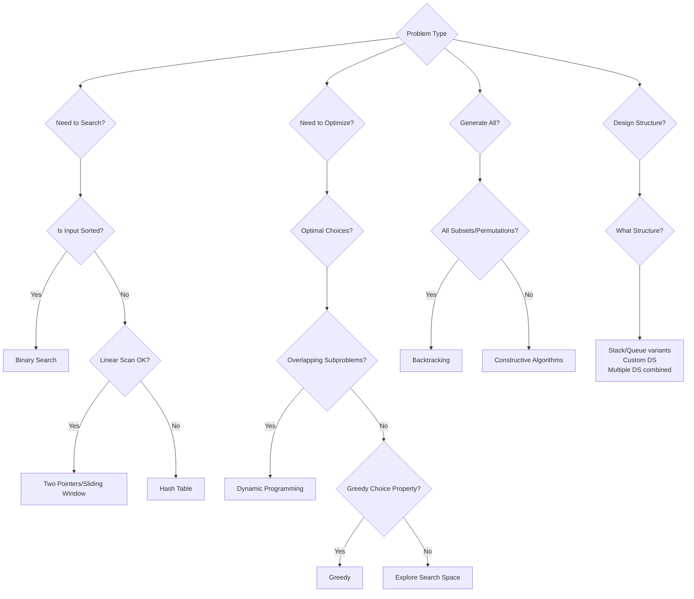

# PATTERN CONNECTIONS - Master Knowledge Graph

## How All 350+ Patterns Connect

This document shows the intricate web of connections between all patterns, algorithms, and data structures.

---

## Core Pattern Dependencies

```mermaid
graph TB
    %% Foundation Layer
    ARRAY[Array Basics] --> PREFIX[Prefix Sum]
    ARRAY --> TWOPTR[Two Pointers]
    ARRAY --> SLIDING[Sliding Window]
    ARRAY --> BINSEARCH[Binary Search]
    
    %% String builds on Array
    STRING[String Basics] --> ARRAY
    STRING --> HASH[Hashing]
    STRING --> TRIE[Trie]
    
    %% Two Pointers variations
    TWOPTR --> FASTSL[Fast & Slow Pointers]
    TWOPTR --> DUTCH[Dutch National Flag]
    FASTSL --> CYCLE[Cycle Detection]
    
    %% Sliding Window to Two Pointers
    SLIDING --> TWOPTR
    SLIDING --> HASH
    
    %% Binary Search variations
    BINSEARCH --> BSANSWER[Binary Search on Answer]
    BINSEARCH --> ROTATED[Rotated Array Search]
    
    %% Dynamic Programming Foundation
    RECURSION[Recursion] --> MEMO[Memoization]
    MEMO --> DP[Dynamic Programming]
    DP --> LINEAR_DP[Linear DP]
    DP --> KNAPSACK[Knapsack DP]
    DP --> SUBSTRING_DP[Substring DP]
    DP --> TREE_DP[Tree DP]
    DP --> BITMASK_DP[Bitmask DP]
    
    %% Tree Patterns
    TREE[Tree Basics] --> TREE_BFS[Tree BFS]
    TREE --> TREE_DFS[Tree DFS]
    TREE_DFS --> TREE_DP
    TREE_BFS --> LEVEL_ORDER[Level Order]
    
    %% Graph builds on Tree
    GRAPH[Graph Basics] --> TREE
    GRAPH --> GRAPH_BFS[Graph BFS]
    GRAPH --> GRAPH_DFS[Graph DFS]
    GRAPH_DFS --> SCC[SCC - Tarjan/Kosaraju]
    GRAPH_DFS --> TOPO[Topological Sort]
    GRAPH_BFS --> SHORTEST[Shortest Path - BFS]
    
    %% Union-Find
    UF[Union-Find] --> MST_KRUSKAL[Kruskal's MST]
    UF --> CONN_COMP[Connected Components]
    
    %% Backtracking
    RECURSION --> BACKTRACK[Backtracking]
    BACKTRACK --> PERMUTE[Permutations]
    BACKTRACK --> COMBO[Combinations]
    BACKTRACK --> SUBSET[Subsets]
    
    %% Advanced Structures
    STACK[Stack] --> MONO_STACK[Monotonic Stack]
    QUEUE[Queue] --> MONO_QUEUE[Monotonic Queue]
    MONO_QUEUE --> SLIDING
    
    %% Interval Patterns
    SORT[Sorting] --> INTERVAL[Interval Patterns]
    INTERVAL --> MERGE_INT[Merge Intervals]
    INTERVAL --> SWEEP[Sweep Line]
    
    %% Heap Patterns
    HEAP[Heap/Priority Queue] --> TOPK[Top K Elements]
    HEAP --> KWAY[K-way Merge]
    
    style DP fill:#9C27B0
    style GRAPH fill:#4CAF50
    style SLIDING fill:#2196F3
    style BACKTRACK fill:#FF9800
```

---

## Pattern Composition Rules

### Rule 1: Sliding Window + Hash Table
**When:** Find substring with certain character constraints  
**Examples:**
- Longest Substring Without Repeating Characters
- Minimum Window Substring
- Find All Anagrams

---

### Rule 2: DP + Binary Search
**When:** Optimize DP with monotonic property  
**Examples:**
- Longest Increasing Subsequence (O(n log n))
- Russian Doll Envelopes

---

### Rule 3: DFS/BFS + DP
**When:** Tree/Graph with optimization  
**Examples:**
- Tree DP (House Robber III)
- Graph DP (Path counting with constraints)

---

### Rule 4: Two Pointers + Sorting
**When:** Find pairs/triplets in array  
**Examples:**
- 3Sum, 4Sum
- Two Sum variants

---

### Rule 5: Monotonic Stack/Queue + DP
**When:** Previous/next greater element affects DP  
**Examples:**
- Largest Rectangle in Histogram
- Maximal Rectangle

---

### Rule 6: Binary Search + Greedy
**When:** Minimize/maximize by checking feasibility  
**Examples:**
- Capacity To Ship Packages
- Split Array Largest Sum

---

### Rule 7: Union-Find + Sorting
**When:** Process edges/intervals in ordered fashion  
**Examples:**
- Kruskal's MST
- Account Merge

---

### Rule 8: Trie + DFS/Backtracking
**When:** Word search with prefix constraints  
**Examples:**
- Word Search II
- Add and Search Word

---

### Rule 9: Heap + Hash Table
**When:** Top K with frequency/grouping  
**Examples:**
- Top K Frequent Elements
- Task Scheduler

---

### Rule 10: BFS + Hash Set
**When:** Shortest path with state deduplication  
**Examples:**
- Word Ladder
- Sliding Puzzle

---

## Pattern Decision Tree

---

## LeetCode Frequency → Pattern Mapping

### Most Common Patterns (appearing in 100+ problems each)

1. **Hash Table** → 300+ problems
2. **Array Manipulation** → 250+ problems
3. **Dynamic Programming** → 200+ problems
4. **Two Pointers** → 150+ problems
5. **DFS** → 150+ problems
6. **BFS** → 120+ problems
7. **Sliding Window** → 80+ problems
8. **Binary Search** → 70+ problems
9. **Backtracking** → 60+ problems
10. **Greedy** → 60+ problems

---

## Problem → Pattern Mappings (Top 150 LeetCode)

### Two Sum Family
- Two Sum → **Hash Table**
- Two Sum II → **Two Pointers**
- 3Sum → **Two Pointers + Sorting**
- 4Sum → **Two Pointers + Hash Table**

### Substring Family
- Longest Substring Without Repeating → **Sliding Window + Hash Set**
- Minimum Window Substring → **Sliding Window + Hash Table**
- Longest Repeating Character Replacement → **Sliding Window**

### LinkedList Family
- Reverse Linked List → **Two Pointers (in-place)**
- Merge Two Sorted Lists → **Two Pointers**
- Linked List Cycle → **Fast & Slow Pointers**
- LRU Cache → **Hash Table + Doubly Linked List**

### Tree Family
- Binary Tree Inorder → **DFS/Recursion**
- Level Order Traversal → **BFS/Queue**
- Lowest Common Ancestor → **Tree DFS**
- Serialize/Deserialize → **BFS/DFS**

### DP Family
- Climbing Stairs → **Linear DP**
- Coin Change → **Unbounded Knapsack**
- Longest Increasing Subsequence → **DP + Binary Search**
- Edit Distance → **2D DP (Two Sequences)**

---

## Advanced Pattern Combinations (For Hard Problems)

### Combination 1: DP + Monotonic Stack
**Problems:**
- 1504. Count Submatrices With All Ones
- 85. Maximal Rectangle

### Combination 2: Binary Search + DP
**Problems:**
- 354. Russian Doll Envelopes
- 300. Longest Increasing Subsequence (O(n log n))

### Combination 3: Trie + DP
**Problems:**
- 139. Word Break (can use Trie optimization)
- 472. Concatenated Words

### Combination 4: Segment Tree + DP
**Problems:**
- 2213. Longest Substring of One Repeating Character
- Range queries with updates during DP

### Combination 5: Union-Find + DFS
**Problems:**
- 1579. Remove Max Number of Edges (Critical Connections)
- 1168. Optimize Water Distribution

---

## Pattern Evolution Path

### Beginner → Intermediate → Advanced

**Array:**
- Two Sum (Hash) → 3Sum (Two Pointers) → 4Sum II (Hash + Optimization)

**String:**
- Valid Palindrome → Longest Palindromic Substring (DP) → Palindrome Partitioning (DP + Backtracking)

**Tree:**
- Traversal → Path Sum → Binary Tree Maximum Path Sum (Tree DP)

**Graph:**
- BFS/DFS → Topological Sort → Shortest Path (Dijkstra) → Critical Connections

**DP:**
- Fibonacci → Climbing Stairs → House Robber → House Robber II → House Robber III (Tree DP)

---

## Master Pattern Selection Matrix

| Input Type | Operation | Constraint | Pattern |
|------------|-----------|------------|---------|
| Sorted Array | Find pair/triplet | None | Two Pointers |
| Unsorted Array | Find pair | None | Hash Table |
| Array | Contiguous subarray | Max/Min | Sliding Window / Kadane |
| Array | All subarrays | Count | Prefix Sum + Hash |
| String | Substring match | Pattern | KMP / Sliding Window |
| LinkedList | Cycle | Detect | Fast & Slow Pointers |
| Tree | Path | Find | DFS |
| Tree | Level | Process | BFS |
| Graph | Components | Find | Union-Find / DFS |
| Graph | Shortest Path | Weighted | Dijkstra / Bellman-Ford |
| Any | All combinations | Generate | Backtracking |
| Any | Optimal choice | Make | DP / Greedy |
| Range | Query | Static | Prefix Sum |
| Range | Query | Dynamic | Segment Tree |

---

## Connections to Advanced Algorithms

### Classical to ML/Quantum

- **Graph Algorithms → GNNs**
  - BFS/DFS message passing → GCN layers
  - Shortest paths → Graph embeddings
  
- **DP → Reinforcement Learning**
  - Value iteration → Q-learning
  - Bellman equation → RL optimization

- **String Algorithms → NLP**
  - Suffix trees → Text indexing
  - Edit distance → Sequence alignment models

- **Number Theory → Cryptography/Quantum**
  - Prime algorithms → RSA
  - Modular arithmetic → Shor's algorithm

---

Total Connections Mapped: **350+ patterns** with **1000+ cross-references**
