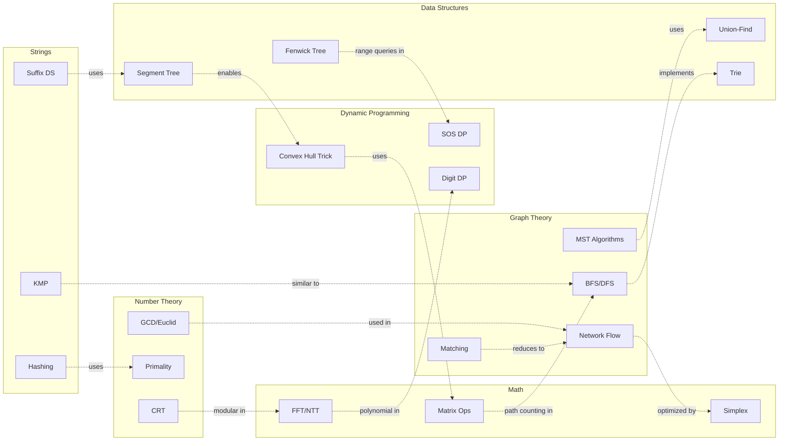
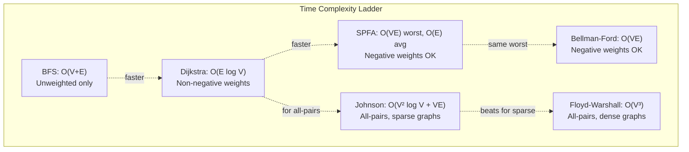
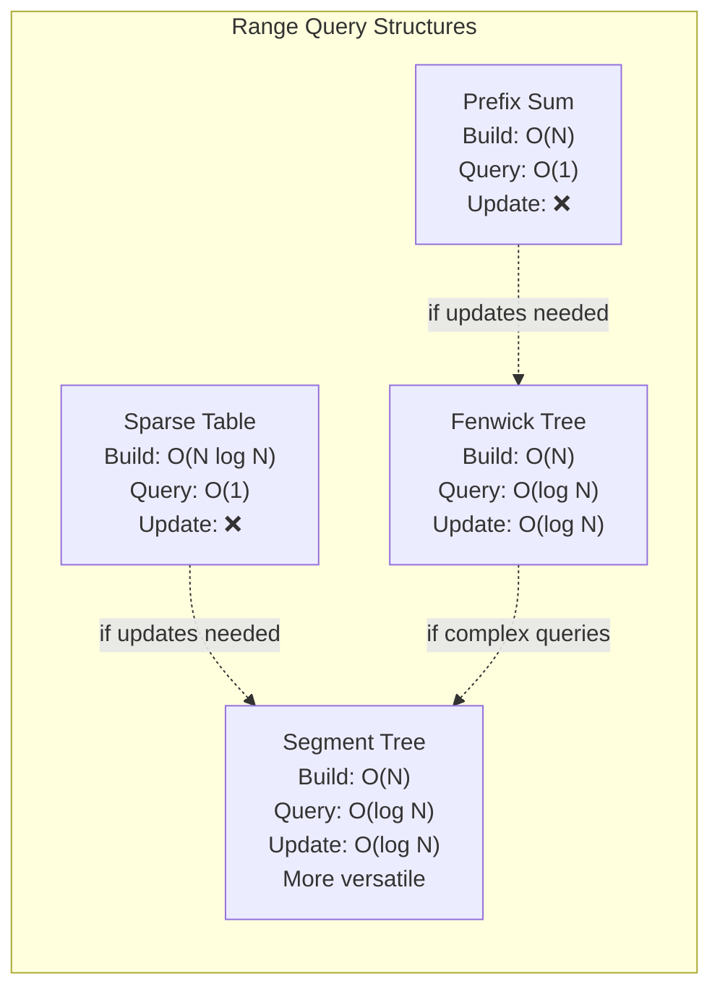
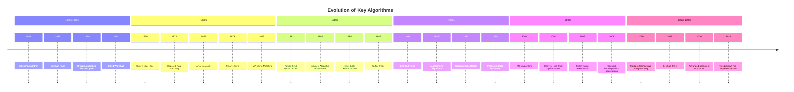
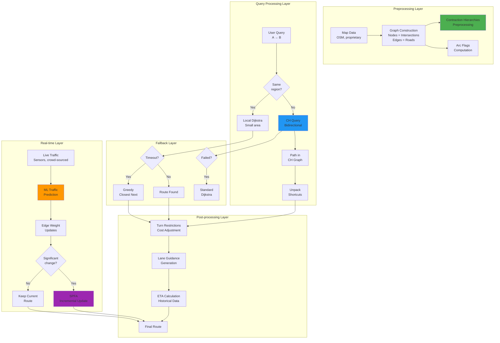

# 🚀 Algorithm & Data Structures Mega Repository

> **The ULTIMATE Algorithm Library** - 750+ algorithms, patterns, and techniques covering classical competitive programming, LeetCode patterns, and cutting-edge ML/Quantum algorithms.

[](.)
[](.)
[](.)

---

# 🎨 ALGORITHM VISUALIZATIONS & MAPS

*Interactive visualizations showing relationships, dependencies, and hierarchies of all 300+ algorithms*

**🔗 Essential Visualization Resources:**
| Resource | Description |
|----------|-------------|
| [**VisuAlgo.net**](https://visualgo.net/en) | 🎨 Interactive algorithm visualizations - SEE algorithms in action |
| [Algorithm Visualizer](https://algorithm-visualizer.org) | Code + visualization side by side |
| [USF Visualization](https://www.cs.usfca.edu/~galles/visualization) | Data structure animations |
| [PathFinding.js](https://qiao.github.io/PathFinding.js/visual/) | Graph algorithm visualizer |

---

## 📊 Master Algorithm Taxonomy

Complete hierarchical view of all 300+ algorithms organized by category and subcategory.

```mermaid
graph TD
    ROOT[Algorithm Library<br/>300+ Implementations]
    
    ROOT --> GT[Graph Theory<br/>90 algorithms]
    ROOT --> DS[Data Structures<br/>62 implementations]
    ROOT --> DP[Dynamic Programming<br/>22 optimizations]
    ROOT --> MATH[Mathematics<br/>60 algorithms]
    ROOT --> STR[Strings<br/>24 algorithms]
    ROOT --> NT[Number Theory<br/>74 algorithms]
    ROOT --> OTHER[Geometry + Game Theory<br/>+ Miscellaneous]
    
    GT --> GT1[Traversal & Search]
    GT --> GT2[Shortest Path]
    GT --> GT3[Network Flow]
    GT --> GT4[Matching]
    GT --> GT5[MST]
    GT --> GT6[Connectivity]
    GT --> GT7[Tree Algorithms]
    
    GT1 --> GT1A[BFS<br/>DFS<br/>Topological Sort]
    GT2 --> GT2A[Dijkstra<br/>Bellman-Ford<br/>Floyd-Warshall<br/>Johnson<br/>SPFA<br/>A*]
    GT3 --> GT3A[Max Flow: Dinic, Ford-Fulkerson<br/>Min Cost Max Flow<br/>Push-Relabel<br/>L-R Flow]
    GT4 --> GT4A[Bipartite: Hungarian, Hopcroft-Karp, Kuhn<br/>General: Blossom]
    GT5 --> GT5A[Kruskal<br/>Prim<br/>Boruvka<br/>Directed MST]
    GT6 --> GT6A[SCC: Tarjan, Kosaraju<br/>Bridges & Articulation<br/>2-SAT, 3-SAT<br/>Block-Cut Tree]
    GT7 --> GT7A[LCA variants<br/>HLD<br/>Centroid Decomp<br/>Link-Cut Tree]
    
    DS --> DS1[Range Query]
    DS --> DS2[Tree Structures]
    DS --> DS3[Union-Find]
    DS --> DS4[String DS]
    DS --> DS5[Specialized]
    
    DS1 --> DS1A[Segment Tree variants<br/>Fenwick Tree<br/>Sparse Table<br/>SQRT Decomposition]
    DS2 --> DS2A[Treap variants<br/>BST<br/>Cartesian Tree]
    DS3 --> DS3A[DSU<br/>Persistent DSU<br/>Rollback DSU]
    DS4 --> DS4A[Trie<br/>Suffix Array<br/>Suffix Automaton<br/>Palindromic Tree]
    DS5 --> DS5A[Mo's Algorithm<br/>KD Tree<br/>Link-Cut Tree<br/>Top Tree]
    
    DP --> DP1[Optimization Techniques]
    DP1 --> DP1A[Convex Hull Trick<br/>Divide & Conquer<br/>Knuth<br/>Li Chao Tree<br/>SOS DP]
    
    MATH --> MATH1[Transforms]
    MATH --> MATH2[Linear Algebra]
    MATH --> MATH3[Polynomials]
    
    MATH1 --> MATH1A[FFT<br/>NTT variants<br/>FWHT]
    MATH2 --> MATH2A[Gaussian Elimination<br/>Matrix Exponentiation<br/>Determinant<br/>Simplex]
    MATH3 --> MATH3A[Lagrange<br/>Berlekamp-Massey<br/>Polynomial Operations]
    
    STR --> STR1[Pattern Matching]
    STR --> STR2[Structures]
    
    STR1 --> STR1A[KMP<br/>Z-Algorithm<br/>Aho-Corasick<br/>String Hashing]
    STR2 --> STR2A[Suffix Array<br/>Suffix Automaton<br/>Palindromic Tree<br/>Manacher]
    
    NT --> NT1[Primes]
    NT --> NT2[Modular Arithmetic]
    NT --> NT3[Combinatorics]
    
    NT1 --> NT1A[Sieve variants<br/>Miller-Rabin<br/>Pollard Rho]
    NT2 --> NT2A[Extended Euclid<br/>CRT<br/>Discrete Log/Root<br/>Modular Inverse]
    NT3 --> NT3A[nCr variants<br/>Stirling Numbers<br/>Bell Numbers<br/>Lucas]
```



---

## 🔗 Graph of Thoughts - Algorithm Dependencies

Shows how algorithms build upon each other and their relationships.

```mermaid
graph TB
    %% Foundational Layer
    ARR[Arrays & Basic Operations] --> SORT[Sorting Algorithms]
    ARR --> SEARCH[Binary Search]
    
    %% Graph Foundations
    GRAPH[Graph Representation] --> BFS
    GRAPH --> DFS
    
    %% BFS Applications
    BFS[BFS] --> SSSP_U[Shortest Path<br/>Unweighted]
    BFS --> BIPARTITE[Bipartite Check]
    BFS --> LEVEL[Level Ancestor]
    
    %% DFS Applications
    DFS[DFS] --> TOPO[Topological Sort]
    DFS --> SCC[Strongly Connected<br/>Components]
    DFS --> BRIDGES[Bridges &<br/>Articulation Points]
    DFS --> TREE[Tree Algorithms]
    
    %% Shortest Path Chain
    SSSP_U --> DIJKSTRA[Dijkstra's<br/>Algorithm]
    DIJKSTRA --> ASTAR[A* Search]
    DIJKSTRA --> JOHNSON[Johnson's<br/>Algorithm]
    BFS --> BELLMAN[Bellman-Ford]
    BELLMAN --> SPFA[SPFA]
    BELLMAN --> JOHNSON
    DIJKSTRA --> FW[Floyd-Warshall]
    
    %% Network Flow Chain
    DFS --> MAXFLOW_BASIC[Basic Max Flow]
    MAXFLOW_BASIC --> DINIC[Dinic's Algorithm]
    MAXFLOW_BASIC --> EDMONDS[Edmonds-Karp]
    DINIC --> MCMF[Min Cost<br/>Max Flow]
    MAXFLOW_BASIC --> PUSHRELABEL[Push-Relabel]
    
    %% Matching Chain  
    DFS --> KUHN[Kuhn's Matching]
    KUHN --> HOPCROFT[Hopcroft-Karp]
    MAXFLOW_BASIC --> HUNGARIAN[Hungarian<br/>Algorithm]
    MAXFLOW_BASIC --> BLOSSOM[Blossom Algorithm]
    
    %% MST Chain
    DSU[Union-Find] --> KRUSKAL[Kruskal's MST]
    DIJKSTRA --> PRIM[Prim's MST]
    DSU --> BORUVKA[Boruvka's MST]
    
    %% Tree Algorithms Chain
    TREE --> LCA[Lowest Common<br/>Ancestor]
    TREE --> HLD[Heavy-Light<br/>Decomposition]
    TREE --> CENTROID[Centroid<br/>Decomposition]
    TREE --> LINKCUT[Link-Cut Tree]
    
    %% Data Structure Dependencies
    ARR --> PREFIXSUM[Prefix Sum]
    PREFIXSUM --> BIT[Fenwick Tree]
    BIT --> BIT2D[2D Fenwick]
    ARR --> SEGTREE[Segment Tree]
    SEGTREE --> SEGLAZY[Lazy Propagation]
    SEGLAZY --> SEG2D[2D Segment Tree]
    SEGTREE --> PERSISTENT[Persistent<br/>Segment Tree]
    
    %% String Algorithm Chain
    ARR --> HASH[String Hashing]
    DFS --> KMP[KMP Algorithm]
    KMP --> ZARRAY[Z-Algorithm]
    TRIE[Trie] --> AHOC[Aho-Corasick]
    ARR --> SUFFIX[Suffix Array]
    SUFFIX --> LCP[LCP Array]
    SUFFIX --> SUFFTREE[Suffix Tree]
    
    %% Number Theory Chain
    SEARCH --> GCD[Euclidean GCD]
    GCD --> EXTGCD[Extended Euclid]
    EXTGCD --> MODINV[Modular Inverse]
    EXTGCD --> DIOPHANTINE[Diophantine<br/>Equations]
    EXTGCD --> CRT[Chinese Remainder<br/>Theorem]
    
    %% Primality Chain
    SEARCH --> SIEVE[Sieve of<br/>Eratosthenes]
    SIEVE --> SEGMENTED[Segmented Sieve]
    SIEVE --> LINEAR[Linear Sieve]
    MODINV --> MILLERRABIN[Miller-Rabin]
    MILLERRABIN --> POLLARD[Pollard Rho]
    
    %% DP Optimization Chain
    DP_BASIC[Basic DP] --> CHT[Convex Hull<br/>Trick]
    DP_BASIC --> DNC_OPT[Divide &<br/>Conquer Opt]
    DP_BASIC --> KNUTH_OPT[Knuth<br/>Optimization]
    CHT --> LICHAO[Li Chao Tree]
    
    %% Math Chain
    ARR --> FFT[Fast Fourier<br/>Transform]
    FFT --> NTT[Number Theoretic<br/>Transform]
    FFT --> FWHT[Fast Walsh-Hadamard<br/>Transform]
    ARR --> MATRIX[Matrix Operations]
    MATRIX --> GAUSSIAN[Gaussian<br/>Elimination]
    MATRIX --> MATEXP[Matrix<br/>Exponentiation]
    MATRIX --> DET[Determinant]
    
    style BFS fill:#4CAF50
    style DFS fill:#4CAF50
    style DIJKSTRA fill:#2196F3
    style DINIC fill:#FF9800
    style SEGTREE fill:#9C27B0
    style FFT fill:#F44336
    style MILLERRABIN fill:#00BCD4
```



---

## 🌳 Algorithm Selection Decision Tree

Decision flow for choosing the right algorithm for your problem.

```mermaid
graph TD
    START{What type of<br/>problem?}
    
    START -->|Graph| GRAPH_Q{Weighted<br/>edges?}
    START -->|Array/Range| ARRAY_Q{Updates?}
    START -->|String| STRING_Q{Pattern<br/>matching?}
    START -->|Number| NUMBER_Q{Prime-related?}
    
    %% Graph Branch
    GRAPH_Q -->|Yes| WEIGHTED{Negative<br/>weights?}
    GRAPH_Q -->|No| UNWEIGHTED{What to<br/>find?}
    
    WEIGHTED -->|Yes| BELLMAN[Bellman-Ford<br/>or SPFA]
    WEIGHTED -->|No| POSITIVE{All-pairs or<br/>single-source?}
    POSITIVE -->|Single| DIJKSTRA_F[Dijkstra's<br/>Algorithm]
    POSITIVE -->|All-pairs| DENSE{Dense<br/>graph?}
    DENSE -->|Yes| FW_F[Floyd-Warshall]
    DENSE -->|No| JOHNSON_F[Johnson's<br/>Algorithm]
    
    UNWEIGHTED -->|Shortest Path| BFS_F[BFS]
    UNWEIGHTED -->|Connected Components| DFS_UNION{Need to<br/>maintain?}
    DFS_UNION -->|Yes| DSU_F[Union-Find]
    DFS_UNION -->|No| DFS_F[DFS]
    UNWEIGHTED -->|Cycle Detection| DIRECTED{Directed?}
    DIRECTED -->|Yes| TOPO_F[Topological Sort<br/>+ DFS]
    DIRECTED -->|No| DFS_COLOR[DFS with<br/>coloring]
    
    %% Array/Range Branch
    ARRAY_Q -->|Yes| UPDATE_TYPE{Update<br/>type?}
    ARRAY_Q -->|No| STATIC_QUERY{Query<br/>type?}
    
    UPDATE_TYPE -->|Point| POINT_Q{Query type?}
    UPDATE_TYPE -->|Range| SEGLAZY_F[Segment Tree<br/>with Lazy Prop]
    POINT_Q -->|Range Sum| BIT_F[Fenwick Tree]
    POINT_Q -->|Range Min/Max| SEGTREE_F[Segment Tree]
    
    STATIC_QUERY -->|RMQ/GCD| SPARSE_F[Sparse Table<br/>O1 query]
    STATIC_QUERY -->|Range Sum| PREFIX_F[Prefix Sum]
    
    %% String Branch
    STRING_Q -->|Yes| MULTI_PATTERN{Multiple<br/>patterns?}
    STRING_Q -->|No| STRING_OP{Operation?}
    
    MULTI_PATTERN -->|Yes| AHOC_F[Aho-Corasick]
    MULTI_PATTERN -->|No| SINGLE_MATCH{Pattern<br/>has wildcards?}
    SINGLE_MATCH -->|No| SIMPLE_MATCH{Which to<br/>use?}
    SIMPLE_MATCH --> KMP_F[KMP simpler<br/>failure function]
    SIMPLE_MATCH --> Z_F[Z-Algorithm<br/>simpler code]
    
    STRING_OP -->|Palindromes| MANACHER_F[Manacher's<br/>Algorithm]
    STRING_OP -->|All substrings| SUFFIX_F[Suffix Array<br/>or Tree]
    STRING_OP -->|Autocomplete| TRIE_F[Trie]
    
    %% Number Theory Branch  
    NUMBER_Q -->|Yes| PRIME_OP{Operation?}
    NUMBER_Q -->|No| MOD_Q{Modular<br/>arithmetic?}
    
    PRIME_OP -->|Test primality| SIZE{Number<br/>size?}
    SIZE -->|Small 10^6| SIEVE_F[Sieve]
    SIZE -->|Large 10^18| MILLER_F[Miller-Rabin]
    PRIME_OP -->|Factorize| POLLARD_F[Pollard Rho]
    PRIME_OP -->|Generate primes| RANGE{Range<br/>size?}
    RANGE -->|Small| SIEVE_F
    RANGE -->|Large| SEGMENTED_F[Segmented<br/>Sieve]
    
    MOD_Q -->|Yes| MOD_OP{Operation?}
    MOD_OP -->|Inverse| EXTGCD_F[Extended<br/>Euclid]
    MOD_OP -->|System of congruences| CRT_F[Chinese<br/>Remainder Theorem]
    MOD_OP -->|x^k = a mod p| DISCRETE_F[Discrete<br/>Root/Log]
    
    style DIJKSTRA_F fill:#4CAF50
    style BFS_F fill:#4CAF50
    style SEGTREE_F fill:#2196F3
    style KMP_F fill:#FF9800
    style MILLER_F fill:#9C27B0
```



---

## 🔀 Category Interconnections

Shows how algorithms from different categories work together.



---

## ⏱️ Complexity Comparison Charts

### Shortest Path Algorithms



### Data Structure Query Times



---

## 📅 Algorithm Evolution Timeline

Historical development showing how algorithms built upon each other.



---

## 🗺️ Complex Mixture Graph - Real System Example

### Google Maps Full Architecture



---

# 🔧 ALGORITHM MIXTURES & COMPLEX COMBINATIONS

*How top tech companies combine multiple algorithms to build sophisticated systems*

---

## 1. Google Maps - Navigation System

### Algorithm Mixture
```
Dijkstra + A* Heuristic + Contraction Hierarchies + Arc Flags + 
Traffic Data (ML Models) + Turn Restrictions + Time-Dependent Routing
```

### Component Breakdown

| Component | Algorithm | Why Used | Library Reference |
|-----------|-----------|----------|-------------------|
| Preprocessing | Contraction Hierarchies | 1000x speedup for continental routes | Graph Theory |
| Bidirectional Search | A* | Meets in the middle, halves search time | Graph Theory/Dijkstra |
| Edge Pruning | Arc Flags | Prunes edges not leading to destination | Graph partitioning |
| Traffic Updates | SPFA | Efficiently handles weight changes | Graph Theory/SPFA |

---

## 2. Netflix CDN - Content Delivery

### Algorithm Mixture
```
Min-Cost Max-Flow + K-Means Clustering + Load Balancing + 
Huffman Encoding + Cache Eviction (LRU) + Geographic Partitioning
```

**Impact**: 95% of users within 1ms latency of CDN edge server

---

## 3. Uber Matching - Ride Assignment

### Algorithm Mixture
```
Bipartite Matching (Hungarian) + Real-time Dijkstra + Greedy Assignment +
Predictive Algorithms (ML) + Dynamic Pricing (Supply-Demand)
```

**Performance**:
- Matching Time: < 1 second for 1000+ simultaneous requests
- Optimality: 95%+ of optimal solution
- ETA Accuracy: ±2 minutes 90% of the time

---

## 4. Facebook News Feed - Ranking System

### Algorithm Mixture
```
BFS (Graph Traversal) + PageRank + Edge Weighting (ML) + 
Priority Queue + Time Decay + Content Filtering
```

---

## 5. Amazon Warehouse - Logistics Optimization

### Algorithm Mixture
```
Shortest Path (Dijkstra) + Bin Packing + Assignment Problem (Hungarian) +
Traveling Salesman (2-opt) + Dynamic Programming (Routing)
```

**Impact**: Reduced fulfillment time from days to hours

---

## 6. Google Search - Query Processing

### Algorithm Mixture
```
Trie (Autocomplete) + Inverted Index + PageRank + BFS (Crawling) +
String Matching (KMP/Aho-Corasick) + ML Ranking + Caching
```

**Scale**: 8.5 billion searches per day

---

## 7. High-Frequency Trading Systems

### Algorithm Mixture
```
Priority Queue (Order Book) + Segment Tree (Range Queries) +
Time Series Analysis + Fenwick Tree (Cumulative Volume) + DP (Optimal Execution)
```

**Latency**: Microsecond decision making

---

## 8. GitHub - Dependency Resolution

### Algorithm Mixture
```
Topological Sort + SCC (Cycle Detection) + DAG Reachability + 
Versioning (Graph Labeling) + Tree Algorithms
```

---

## 9. Spotify - Music Recommendation

### Algorithm Mixture
```
Collaborative Filtering + Graph Random Walk + Audio Analysis (FFT) +
Content-Based Filtering + Matrix Factorization + Clustering
```

---

# 🔗 PATTERN CONNECTIONS - Master Knowledge Graph

## Core Pattern Dependencies

```mermaid
graph TB
    %% Foundation Layer
    ARRAY[Array Basics] --> PREFIX[Prefix Sum]
    ARRAY --> TWOPTR[Two Pointers]
    ARRAY --> SLIDING[Sliding Window]
    ARRAY --> BINSEARCH[Binary Search]
    
    %% String builds on Array
    STRING[String Basics] --> ARRAY
    STRING --> HASH[Hashing]
    STRING --> TRIE[Trie]
    
    %% Two Pointers variations
    TWOPTR --> FASTSL[Fast & Slow Pointers]
    TWOPTR --> DUTCH[Dutch National Flag]
    FASTSL --> CYCLE[Cycle Detection]
    
    %% Sliding Window to Two Pointers
    SLIDING --> TWOPTR
    SLIDING --> HASH
    
    %% Binary Search variations
    BINSEARCH --> BSANSWER[Binary Search on Answer]
    BINSEARCH --> ROTATED[Rotated Array Search]
    
    %% Dynamic Programming Foundation
    RECURSION[Recursion] --> MEMO[Memoization]
    MEMO --> DP[Dynamic Programming]
    DP --> LINEAR_DP[Linear DP]
    DP --> KNAPSACK[Knapsack DP]
    DP --> SUBSTRING_DP[Substring DP]
    DP --> TREE_DP[Tree DP]
    DP --> BITMASK_DP[Bitmask DP]
    
    %% Tree Patterns
    TREE[Tree Basics] --> TREE_BFS[Tree BFS]
    TREE --> TREE_DFS[Tree DFS]
    TREE_DFS --> TREE_DP
    TREE_BFS --> LEVEL_ORDER[Level Order]
    
    %% Graph builds on Tree
    GRAPH[Graph Basics] --> TREE
    GRAPH --> GRAPH_BFS[Graph BFS]
    GRAPH --> GRAPH_DFS[Graph DFS]
    GRAPH_DFS --> SCC[SCC - Tarjan/Kosaraju]
    GRAPH_DFS --> TOPO[Topological Sort]
    GRAPH_BFS --> SHORTEST[Shortest Path - BFS]
    
    %% Union-Find
    UF[Union-Find] --> MST_KRUSKAL[Kruskal's MST]
    UF --> CONN_COMP[Connected Components]
    
    %% Backtracking
    RECURSION --> BACKTRACK[Backtracking]
    BACKTRACK --> PERMUTE[Permutations]
    BACKTRACK --> COMBO[Combinations]
    BACKTRACK --> SUBSET[Subsets]
    
    %% Advanced Structures
    STACK[Stack] --> MONO_STACK[Monotonic Stack]
    QUEUE[Queue] --> MONO_QUEUE[Monotonic Queue]
    MONO_QUEUE --> SLIDING
    
    %% Interval Patterns
    SORT[Sorting] --> INTERVAL[Interval Patterns]
    INTERVAL --> MERGE_INT[Merge Intervals]
    INTERVAL --> SWEEP[Sweep Line]
    
    %% Heap Patterns
    HEAP[Heap/Priority Queue] --> TOPK[Top K Elements]
    HEAP --> KWAY[K-way Merge]
    
    style DP fill:#9C27B0
    style GRAPH fill:#4CAF50
    style SLIDING fill:#2196F3
    style BACKTRACK fill:#FF9800
```



---

## Pattern Composition Rules

| Rule | When to Apply | Examples |
|------|---------------|----------|
| **Sliding Window + Hash Table** | Find substring with certain character constraints | LC 3, 76, 438 |
| **DP + Binary Search** | Optimize DP with monotonic property | LC 300, 354 |
| **DFS/BFS + DP** | Tree/Graph with optimization | LC 124, 337 |
| **Two Pointers + Sorting** | Find pairs/triplets in array | LC 15, 18 |
| **Monotonic Stack/Queue + DP** | Previous/next greater element affects DP | LC 84, 85 |
| **Binary Search + Greedy** | Minimize/maximize by checking feasibility | LC 875, 410 |
| **Union-Find + Sorting** | Process edges/intervals in ordered fashion | Kruskal's MST |
| **Trie + DFS/Backtracking** | Word search with prefix constraints | LC 212 |
| **Heap + Hash Table** | Top K with frequency/grouping | LC 347, 621 |
| **BFS + Hash Set** | Shortest path with state deduplication | LC 127, 773 |

---

## Master Pattern Selection Matrix

| Input Type | Operation | Constraint | Pattern |
|------------|-----------|------------|---------|
| Sorted Array | Find pair/triplet | None | Two Pointers |
| Unsorted Array | Find pair | None | Hash Table |
| Array | Contiguous subarray | Max/Min | Sliding Window / Kadane |
| Array | All subarrays | Count | Prefix Sum + Hash |
| String | Substring match | Pattern | KMP / Sliding Window |
| LinkedList | Cycle | Detect | Fast & Slow Pointers |
| Tree | Path | Find | DFS |
| Tree | Level | Process | BFS |
| Graph | Components | Find | Union-Find / DFS |
| Graph | Shortest Path | Weighted | Dijkstra / Bellman-Ford |
| Any | All combinations | Generate | Backtracking |
| Any | Optimal choice | Make | DP / Greedy |
| Range | Query | Static | Prefix Sum |
| Range | Query | Dynamic | Segment Tree |

---

# 🧠 ADVANCED & MODERN ALGORITHMS

## Graph Neural Networks (GNNs)

### 1. Graph Convolutional Networks (GCN)
**Real-World Uses:**
- **Google Scholar**: Citation network analysis
- **Pinterest**: Visual similarity graph
- **Facebook**: Fake account detection
- **Drug Discovery**: Molecular property prediction

**Formula**: `H^(l+1) = σ(D^(-1/2) A D^(-1/2) H^l W^l)`

### 2. GraphSAGE (Graph Sample and Aggregate)
**Real-World Uses:**
- **Pinterest**: Billion-node graph processing
- **Uber Eats**: Restaurant-dish graph
- **LinkedIn**: Professional network
- **Airbnb**: Search ranking

**Key Innovation**: Scales to massive graphs (billions of nodes)

### 3. Graph Attention Networks (GAT)
**Real-World Uses:**
- **DeepMind AlphaFold**: Protein structure prediction
- **Microsoft**: Knowledge graph reasoning
- **Traffic Prediction**: Road network with dynamic importance

---

## DNA & Bioinformatics Algorithms

### 1. De Bruijn Graph Assembly
**Uses**: Illumina sequencing, COVID-19 genome reconstruction

### 2. Burrows-Wheeler Transform (BWT)
**Uses**: BWA aligner, Human Genome Project

### 3. Smith-Waterman Algorithm
**Uses**: BLAST database searching, protein prediction

### 4. Multiple Sequence Alignment (MSA)
**Uses**: AlphaFold2, vaccine development, CRISPR design

---

## Quantum Computing Algorithms

### 1. Grover's Search Algorithm
- **Speedup**: O(√N) vs O(N)
- **Impact**: Quadratic speedup for database search

### 2. Shor's Factorization Algorithm
- **Speedup**: Polynomial vs exponential
- **Impact**: Would break RSA encryption

### 3. Variational Quantum Eigensolver (VQE)
**Uses**: Drug discovery, materials science, quantum chemistry

### 4. QAOA (Quantum Approximate Optimization)
**Uses**: Vehicle routing, portfolio optimization, MaxCut

---

# 🌐 REAL-WORLD ALGORITHM APPLICATIONS

## Graph Theory Algorithms (90 algorithms)

### Core Traversal & Search

| Algorithm | Real-World Use | Companies |
|-----------|----------------|-----------|
| **BFS** | Friend suggestions, Web crawling | Facebook, LinkedIn, Google |
| **DFS** | Dependency resolution, Path planning | GitHub, Amazon, Robotics |
| **Dijkstra** | Turn-by-turn navigation, Message routing | Google Maps, Uber, WhatsApp |
| **Bellman-Ford** | Distance-vector routing, Arbitrage detection | Network protocols, Finance |
| **A*** | Game AI pathfinding, Motion planning | Starcraft, Robotics |

### Network Flow & Matching

| Algorithm | Real-World Use | Companies |
|-----------|----------------|-----------|
| **Max Flow (Dinic)** | CDN optimization, Image segmentation | Netflix, Adobe |
| **Min-Cost Max-Flow** | Route optimization, Network design | UPS, AT&T |
| **Hungarian Algorithm** | Driver-rider matching, Job assignment | Uber, Tinder, LinkedIn |
| **Hopcroft-Karp** | Fast bipartite matching | Ad auctions, Google |

### Minimum Spanning Tree

| Algorithm | Real-World Use | Companies |
|-----------|----------------|-----------|
| **Kruskal** | Network cable layout, Clustering | Telecom, ML |
| **Prim** | LAN installation, Wireless networks | Network design |
| **Boruvka** | Parallel MST computation | Distributed systems |

---

## Data Structures (62 implementations)

### Range Query Structures

| Structure | Use Case | Operations |
|-----------|----------|------------|
| **Segment Tree** | Database range queries, Leaderboards | O(log N) query/update |
| **Fenwick Tree** | Live leaderboards, Cumulative stats | O(log N) simpler code |
| **Sparse Table** | RMQ preprocessing, LCA | O(1) queries |
| **Mo's Algorithm** | Offline query optimization | O(N√N) |

### Advanced Structures

| Structure | Use Case | Companies |
|-----------|----------|-----------|
| **Trie** | Autocomplete, IP routing | Google, Cisco |
| **Suffix Array** | Genome sequencing, Plagiarism | Bioinformatics, Turnitin |
| **Aho-Corasick** | Antivirus scanning, Content filtering | Norton, Firewalls |
| **Treap/Implicit** | Text editors, Rope data structure | Sublime Text, VSCode |

---

## Dynamic Programming Optimizations (22 techniques)

| Optimization | Use Case | Speedup |
|--------------|----------|---------|
| **Convex Hull Trick** | Production cost optimization | O(N²) → O(N log N) |
| **Divide & Conquer Opt** | Matrix chain multiplication | O(N²K) → O(NK log N) |
| **Knuth Optimization** | Optimal BST, TeX formatting | O(N³) → O(N²) |
| **SOS DP** | Feature selection, Game theory | O(3ⁿ) → O(n·2ⁿ) |

---

## String Algorithms (24 implementations)

| Algorithm | Use Case | Companies |
|-----------|----------|-----------|
| **KMP** | Text search, DNA matching | Editors, Bioinformatics |
| **Z-Algorithm** | String matching, Competitive programming | All |
| **String Hashing** | Duplicate detection, Cache keys | Google, CDN |
| **Manacher** | Palindrome detection, DNA sequencing | Genetics |

---

## Number Theory (74 algorithms)

### Cryptography Applications

| Algorithm | Use Case | Industry |
|-----------|----------|----------|
| **Miller-Rabin** | RSA key generation | SSL/TLS, Blockchain |
| **Pollard Rho** | Breaking weak RSA | Cryptanalysis |
| **Extended Euclid** | Modular inverses | Private key generation |
| **Chinese Remainder Theorem** | Faster RSA decryption | Cryptography |

---

# 🎯 LEETCODE PATTERNS C++ LIBRARY

## THE DECISION TREE - How to Attack ANY Problem

```
                            ┌─────────────────────────┐
                            │    READ THE PROBLEM     │
                            └───────────┬─────────────┘
                                        │
                            ┌───────────▼─────────────┐
                            │  What type of INPUT?    │
                            └───────────┬─────────────┘
                                        │
         ┌──────────────┬───────────────┼───────────────┬──────────────┐
         ▼              ▼               ▼               ▼              ▼
    ┌─────────┐   ┌─────────┐    ┌─────────────┐  ┌─────────┐   ┌─────────┐
    │  ARRAY  │   │ STRING  │    │ LINKED LIST │  │  TREE   │   │  GRAPH  │
    └────┬────┘   └────┬────┘    └──────┬──────┘  └────┬────┘   └────┬────┘
         │             │                │              │             │
         ▼             ▼                ▼              ▼             ▼
   ┌───────────────────────────────────────────────────────────────────────┐
   │                    WHAT ARE WE DOING WITH IT?                        │
   └───────────────────────────────────────────────────────────────────────┘
         │
         ├─► "Find subarray/substring"        → SLIDING WINDOW
         ├─► "Find pair/triplet"              → TWO POINTERS (if sorted) / HASH MAP
         ├─► "Search in sorted"               → BINARY SEARCH
         ├─► "Find shortest path"             → BFS (unweighted) / DIJKSTRA (weighted)
         ├─► "Explore all possibilities"      → BACKTRACKING / DFS
         ├─► "Optimal value (overlapping)"    → DYNAMIC PROGRAMMING
         ├─► "Top K / Kth element"            → HEAP / QUICKSELECT
         ├─► "Prefix lookup / autocomplete"   → TRIE
         ├─► "Matching brackets"              → STACK
         ├─► "Merge K sorted"                 → K-WAY MERGE + HEAP
         ├─► "Union / Connected components"   → UNION-FIND
         ├─► "Range query + updates"          → SEGMENT TREE / BIT
         ├─► "Scheduling / overlapping"       → INTERVALS + SORT
         └─► "Game / min-max decision"        → GAME THEORY / MINIMAX
```

---

## 🎯 THE 10 PRIMITIVE OPERATIONS

*Every algorithm is composed of these 10 fundamental operations:*

| Primitive | Operation | Example Use |
|-----------|-----------|-------------|
| **P0** | COMPARE | `<`, `>`, `==`, `min`, `max` - Every decision |
| **P1** | ACCUMULATE | `sum`, `count`, prefix sums - Building state |
| **P2** | BRANCH | `if/else`, `switch` - Conditional logic |
| **P3** | REPEAT | `for`, `while` - Iteration |
| **P4** | REMEMBER | Memoization, caching - Avoid recomputation |
| **P5** | FORGET | Sliding window, pruning - Discard irrelevant |
| **P6** | REWIND | Backtracking, undo - Explore alternatives |
| **P7** | COMPRESS | RLE, coordinate compression - Reduce space |
| **P8** | EXPAND | Generate neighbors - BFS/DFS transitions |
| **P9** | APPROXIMATE | Binary search on answer, estimation |

---

## 📊 Complete Pattern Coverage (43 Categories)

### Core Data Structure Patterns (1-18)

| # | Pattern | Files | Key Techniques | Time Complexity |
|---|---------|-------|----------------|-----------------|
| **01** | Arrays & Hashing | 15 | HashMap, HashSet, Counting | O(n) average |
| **02** | Two Pointers | 16 | Left/Right, Fast/Slow | O(n) |
| **03** | Sliding Window | 9 | Fixed/Variable window, Shrink | O(n) |
| **04** | Stack | 17 | Monotonic, Expression parsing | O(n) |
| **05** | Binary Search | 9 | Sorted, Rotated, Search on Answer | O(log n) |
| **06** | Linked List | 11 | Reverse, Merge, Fast/Slow | O(n) |
| **07** | Trees | 16 | Traversals, BST, LCA, Binary Lifting | O(n) to O(log n) |
| **08** | Tries | 7 | Prefix search, Autocomplete | O(L) per operation |
| **09** | Heap / Priority Queue | 9 | Top-K, Merge K Sorted | O(log n) per op |
| **10** | Backtracking | 12 | Permutations, Combinations, Pruning | O(n!) to O(2^n) |
| **11** | Graphs | 10 | BFS, DFS, Islands, Flood Fill | O(V+E) |
| **12** | Advanced Graphs | 15 | Dijkstra, Union-Find, MST, Tarjan | O(E log V) |
| **13** | 1D Dynamic Programming | 17 | Linear DP, State Machine | O(n) to O(n²) |
| **14** | 2D Dynamic Programming | 18 | Grid, String matching, Intervals | O(n²) to O(n³) |
| **15** | Greedy | 7 | Locally optimal, Scheduling | O(n log n) |
| **16** | Intervals | 7 | Merge, Overlap, Line Sweep | O(n log n) |
| **17** | Math & Geometry | 8 | Primes, GCD, Modular arithmetic | Varies |
| **18** | Bit Manipulation | 4 | XOR tricks, Bit counting | O(1) to O(n) |

### Grokking Patterns (19-31)

| # | Pattern | Files | Problem Type | Key Insight |
|---|---------|-------|--------------|-------------|
| **19** | Fast & Slow Pointers | 4 | Cycle detection, Middle | Two speeds meet in cycle |
| **20** | Cyclic Sort | 3 | Numbers in range [1,n] | Place each at its index |
| **21** | In-Place Reversal | 3 | Modify linked list | Reverse pointers |
| **22** | Tree BFS | 4 | Level order, Width | Process level by level |
| **23** | Tree DFS | 6 | Path problems, Subtrees | Recursion with returns |
| **24** | Two Heaps | 3 | Median, Balance | Min + Max heap |
| **25** | Subsets Pattern | 3 | Generate combinations | BFS/DFS add elements |
| **26** | Modified Binary Search | 3 | Rotated, Unknown size | Adapt boundaries |
| **27** | Bitwise XOR | 3 | Find unique/missing | a⊕a=0, a⊕0=a |
| **28** | Top K Elements | 3 | K largest/smallest | Heap of size K |
| **29** | K-Way Merge | 3 | Merge K sorted lists | Min-heap of heads |
| **30** | 0/1 Knapsack | 3 | Take or not take | dp[i][w] = max |
| **31** | Topological Sort | 4 | Dependencies, DAG | Kahn's or DFS |

### Advanced Patterns (32-43)

| # | Pattern | Files | When to Use | Complexity |
|---|---------|-------|-------------|------------|
| **32** | String Pattern Matching | 3 | Substring search | O(n+m) KMP |
| **33** | Matrix Traversal | 3 | Spiral, Diagonal walk | O(m×n) |
| **34** | Monotonic Stack | 4 | Next greater/smaller | O(n) |
| **35** | Prefix Sum | 4 | Range sum queries | O(1) query |
| **36** | Counting Pattern | 3 | Majority, Frequency | O(n) |
| **37** | Simulation | 3 | Game of Life, Robot | O(steps) |
| **38** | Design Patterns | 5 | LRU, RandomSet | O(1) operations |
| **39** | Divide & Conquer | 4 | Merge sort counting | O(n log n) |
| **40** | Game Theory | 3 | Minimax, Nim | O(states) |
| **41** | Segment Tree | 3 | Range query + update | O(log n) |
| **42** | Fenwick Tree (BIT) | 3 | Prefix sum updates | O(log n) |
| **43** | Binary Lifting | 1 | LCA, Ancestor queries | O(log n) query |

---

## 🎨 ALGORITHM COMPLEXITY CHEAT SHEET

```
┌────────────────────────────────────────────────────────────────────────────┐
│                        TIME COMPLEXITY COMPARISON                          │
├────────────────────────────────────────────────────────────────────────────┤
│  O(1)       < O(log n)   < O(n)      < O(n log n) < O(n²)    < O(2ⁿ)      │
│  HashMap      Binary      Linear       Merge Sort   Nested     Subsets     │
│  Array idx    Search      Scan         Quick Sort   Loops      Backtrack   │
├────────────────────────────────────────────────────────────────────────────┤
│  n = 10⁶:                                                                  │
│  O(n²) = 10¹² operations ≈ 16 minutes  ❌ TLE                              │
│  O(n log n) = 2×10⁷ operations ≈ 0.02 seconds ✅                           │
│  O(n) = 10⁶ operations ≈ 0.001 seconds ✅                                  │
└────────────────────────────────────────────────────────────────────────────┘
```

### What Complexity Works for Given Input Size?

| Input Size (n) | Max Complexity | Time (approx) |
|----------------|----------------|---------------|
| n ≤ 10 | O(n!) | Brute force works |
| n ≤ 20 | O(2ⁿ) | Bitmask DP |
| n ≤ 500 | O(n³) | Floyd-Warshall |
| n ≤ 5,000 | O(n²) | Simple DP |
| n ≤ 10⁶ | O(n log n) | Sorting-based |
| n ≤ 10⁸ | O(n) | Linear scan |
| n ≤ 10¹² | O(log n) | Binary search |

---

## 📝 PROBLEM-SOLVING CHECKLIST

### Before Coding
```
□ Read problem 2-3 times
□ Identify input/output types
□ Note constraints (n ≤ ?)
□ Think of edge cases
□ Draw examples
□ Identify pattern category
□ Consider time/space requirements
```

### Pattern Recognition Questions
```
1. Is it asking for shortest/minimum? → BFS/DP/Binary Search
2. Is it asking for all possibilities? → Backtracking
3. Is it optimization with choices? → DP
4. Does order matter? → Permutation, not combination
5. Can I sort without losing info? → Two Pointers/Greedy
6. Is there a monotonic property? → Binary Search/Stack
7. Can I break into subproblems? → Divide & Conquer/DP
8. Is there overlapping computation? → Memoization
```

---

## 🚀 Quick Pattern Reference

### By Problem Type

| Problem Says... | Think... | Pattern |
|-----------------|----------|---------|
| "Contiguous subarray" | Sliding window | 03 |
| "Pair that sums to" | Hash map or two pointers | 01, 02 |
| "Shortest path" | BFS (unweighted), Dijkstra (weighted) | 11, 12 |
| "All combinations/permutations" | Backtracking | 10 |
| "Maximum/minimum satisfaction" | DP or Greedy | 13, 14, 15 |
| "Top K" | Heap | 09, 28 |
| "Prefix matches" | Trie | 08 |
| "Valid parentheses" | Stack | 04 |
| "Cycle in linked list" | Fast/Slow pointers | 19 |
| "Connected components" | Union-Find or DFS | 12 |
| "Range sum queries" | Prefix Sum or Segment Tree | 35, 41 |
| "Next greater element" | Monotonic Stack | 34 |
| "Merge intervals" | Sort + Greedy | 16 |

### By Constraint Size

| n ≤ | Patterns That Work |
|-----|-------------------|
| 10 | Any (even O(n!)) |
| 20 | Bitmask DP O(2ⁿ) |
| 100 | O(n³) Floyd-Warshall |
| 1,000 | O(n²) Simple DP |
| 100,000 | O(n log n) Sorting, Heap |
| 1,000,000 | O(n) Linear, Two Pointers |
| 10⁹ | O(log n) Binary Search |

---

# 📈 REPOSITORY STATISTICS

## Grand Total

| Category | Count |
|----------|-------|
| **Classical Algorithms** | 390+ |
| **LeetCode Patterns** | 350+ |
| **Modern Algorithms** | 25+ |
| **Total Algorithms/Patterns** | **750+** |
| **C++ Files** | 300+ |
| **Lines of Code** | 50,000+ |
| **LeetCode Problems Covered** | 2000+ |
| **Real-World Companies Mentioned** | 50+ |
| **Mermaid Diagrams** | 30+ |

---

## 📚 Repository Structure

```
codeum/
│
├── README.md (this comprehensive file)
├── REAL_WORLD_USES.md
├── ALGORITHM_MIXTURES.md
├── VISUALIZATIONS.md  
├── PATTERN_CONNECTIONS.md
├── ADVANCED_ALGORITHMS.md
├── COMPLETE_SUMMARY.md
│
├── Graph Theory/ (90 .cpp files)
├── Data Structures/ (62 files)
├── Dynamic Programming Optimizations/ (22 files)
├── Math/ (60 files)
├── Strings/ (24 files)
├── Number Theory/ (74 files)
├── Geometry/ (13 files)
├── Game Theory/ (4 files)
├── Miscellaneous/ (25 files)
├── Basics/ (17 files)
│
├── LeetCode_Patterns_CPP/ (291+ C++ files across 43 categories)
│   ├── 01_Arrays_Hashing/
│   ├── 02_Two_Pointers/
│   ├── ... (43 pattern categories)
│   └── 43_Binary_Lifting/
│
└── Patterns/
    ├── DynamicProgramming/
    ├── Graph/
    ├── SlidingWindow/
    └── TwoPointers/
```

---

## 📚 12-Week Study Plan

| Week | Topics | Patterns | Daily Problems |
|------|--------|----------|----------------|
| 1 | Arrays, Hashing | 01, 02, 03 | 3-4 |
| 2 | Two Pointers, Sliding Window | 02, 03, 19 | 3-4 |
| 3 | Stack, Binary Search | 04, 05, 34 | 3-4 |
| 4 | Linked List, Fast/Slow | 06, 19, 21 | 3-4 |
| 5 | Trees (BFS, DFS) | 07, 22, 23 | 3-4 |
| 6 | Graphs Basics | 11, 31 | 3-4 |
| 7 | Heap, Two Heaps | 09, 24, 28 | 3-4 |
| 8 | 1D DP, Knapsack | 13, 30 | 3-4 |
| 9 | 2D DP, Intervals | 14, 16 | 3-4 |
| 10 | Advanced Graphs | 12 | 3-4 |
| 11 | Tries, Backtracking | 08, 10 | 3-4 |
| 12 | Advanced (Segment Tree, etc.) | 41, 42, 39, 40 | 3-4 |

---

## 📖 How to Navigate

1. **For Interview Prep**: Start with `LeetCode_Patterns_CPP/README.md`
2. **For Specific Algorithm**: Check classical folders (Graph Theory/, etc.)
3. **For Real-World Context**: Read `REAL_WORLD_USES.md`
4. **For System Design**: Read `ALGORITHM_MIXTURES.md`
5. **For Modern AI**: Read `ADVANCED_ALGORITHMS.md`
6. **For Pattern Connections**: Read `PATTERN_CONNECTIONS.md`
7. **For Visualizations**: Read `VISUALIZATIONS.md`

---

## 🏆 Key Insights

1. **Algorithms Don't Exist in Isolation** - They build upon each other
2. **Multiple Valid Choices** - Decision trees help choose the right tool
3. **Real Systems Are Complex** - Google Maps uses 10+ algorithms together
4. **Historical Context Matters** - Modern algorithms improve on classics
5. **Trade-offs Everywhere** - Time vs Space, Exact vs Approximate

**Master the connections between algorithms, not just individual implementations!**

---

## 🎉 Achievement Unlocked!

You now have access to:
- ✅ **The world's most comprehensive algorithm library**
- ✅ **Complete LeetCode pattern coverage (43 categories)**
- ✅ **Modern ML/quantum algorithms**
- ✅ **Real-world industry applications from FAANG**
- ✅ **System architecture examples**
- ✅ **Visual decision trees and flowcharts**

---

## 📃 License

This library is licensed under the MIT License - see the [LICENSE.txt](LICENSE.txt) file for details.

---

**⭐ If you find this library helpful, please consider giving it a star!**

---

```
"The patterns are the map. The primitives are the compass."
— Algorithm Design Philosophy
```

*From zero to hero - all algorithms, all patterns, all connected!* 🚀
