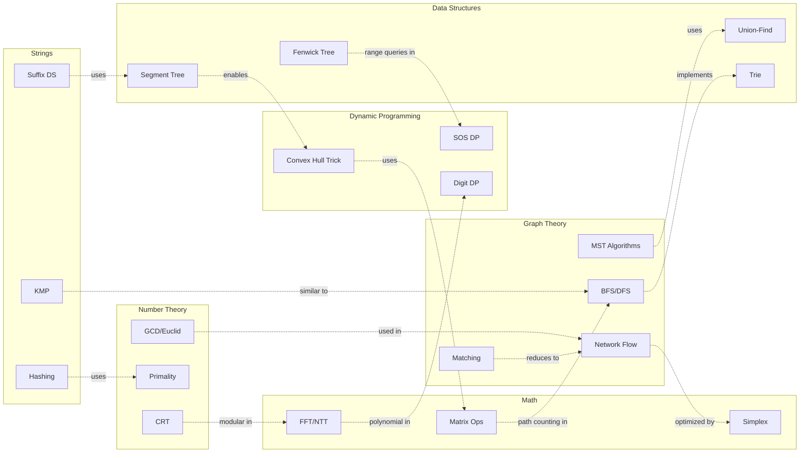
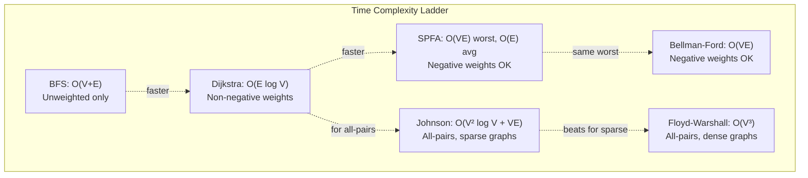
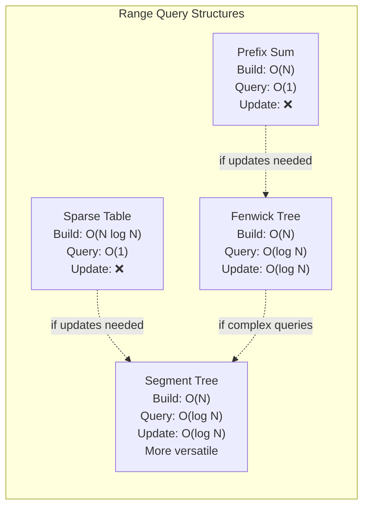
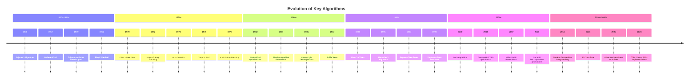
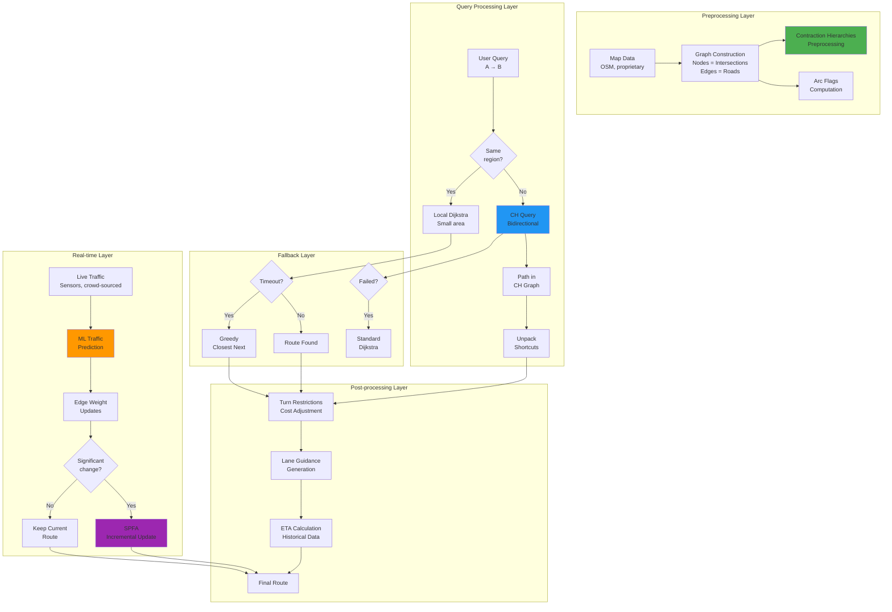

# Algorithm Visualizations & Maps

This document contains complex visualizations showing the relationships, dependencies, and hierarchies of all 300+ algorithms in this library.

---

## Table of Contents

1. [Master Algorithm Taxonomy](#master-algorithm-taxonomy)
2. [Graph of Thoughts - Algorithm Dependencies](#graph-of-thoughts---algorithm-dependencies)
3. [Algorithm Selection Decision Tree](#algorithm-selection-decision-tree)
4. [Category Interconnections](#category-interconnections)
5. [Complexity Comparison Charts](#complexity-comparison-charts)
6. [Algorithm Evolution Timeline](#algorithm-evolution-timeline)

---

## Master Algorithm Taxonomy

Complete hierarchical view of all 300+ algorithms organized by category and subcategory.

```mermaid
graph TD
    ROOT[Algorithm Library<br/>300+ Implementations]
    
    ROOT --> GT[Graph Theory<br/>90 algorithms]
    ROOT --> DS[Data Structures<br/>62 implementations]
    ROOT --> DP[Dynamic Programming<br/>22 optimizations]
    ROOT --> MATH[Mathematics<br/>60 algorithms]
    ROOT --> STR[Strings<br/>24 algorithms]
    ROOT --> NT[Number Theory<br/>74 algorithms]
    ROOT --> OTHER[Geometry + Game Theory<br/>+ Miscellaneous]
    
    GT --> GT1[Traversal & Search]
    GT --> GT2[Shortest Path]
    GT --> GT3[Network Flow]
    GT --> GT4[Matching]
    GT --> GT5[MST]
    GT --> GT6[Connectivity]
    GT --> GT7[Tree Algorithms]
    
    GT1 --> GT1A[BFS<br/>DFS<br/>Topological Sort]
    GT2 --> GT2A[Dijkstra<br/>Bellman-Ford<br/>Floyd-Warshall<br/>Johnson<br/>SPFA<br/>A*]
    GT3 --> GT3A[Max Flow: Dinic, Ford-Fulkerson<br/>Min Cost Max Flow<br/>Push-Relabel<br/>L-R Flow]
    GT4 --> GT4A[Bipartite: Hungarian, Hopcroft-Karp, Kuhn<br/>General: Blossom]
    GT5 --> GT5A[Kruskal<br/>Prim<br/>Boruvka<br/>Directed MST]
    GT6 --> GT6A[SCC: Tarjan, Kosaraju<br/>Bridges & Articulation<br/>2-SAT, 3-SAT<br/>Block-Cut Tree]
    GT7 --> GT7A[LCA variants<br/>HLD<br/>Centroid Decomp<br/>Link-Cut Tree]
    
    DS --> DS1[Range Query]
    DS --> DS2[Tree Structures]
    DS --> DS3[Union-Find]
    DS --> DS4[String DS]
    DS --> DS5[Specialized]
    
    DS1 --> DS1A[Segment Tree variants<br/>Fenwick Tree<br/>Sparse Table<br/>SQRT Decomposition]
    DS2 --> DS2A[Treap variants<br/>BST<br/>Cartesian Tree]
    DS3 --> DS3A[DSU<br/>Persistent DSU<br/>Rollback DSU]
    DS4 --> DS4A[Trie<br/>Suffix Array<br/>Suffix Automaton<br/>Palindromic Tree]
    DS5 --> DS5A[Mo's Algorithm<br/>KD Tree<br/>Link-Cut Tree<br/>Top Tree]
    
    DP --> DP1[Optimization Techniques]
    DP1 --> DP1A[Convex Hull Trick<br/>Divide & Conquer<br/>Knuth<br/>Li Chao Tree<br/>SOS DP]
    
    MATH --> MATH1[Transforms]
    MATH --> MATH2[Linear Algebra]
    MATH --> MATH3[Polynomials]
    
    MATH1 --> MATH1A[FFT<br/>NTT variants<br/>FWHT]
    MATH2 --> MATH2A[Gaussian Elimination<br/>Matrix Exponentiation<br/>Determinant<br/>Simplex]
    MATH3 --> MATH3A[Lagrange<br/>Berlekamp-Massey<br/>Polynomial Operations]
    
    STR --> STR1[Pattern Matching]
    STR --> STR2[Structures]
    
    STR1 --> STR1A[KMP<br/>Z-Algorithm<br/>Aho-Corasick<br/>String Hashing]
    STR2 --> STR2A[Suffix Array<br/>Suffix Automaton<br/>Palindromic Tree<br/>Manacher]
    
    NT --> NT1[Primes]
    NT --> NT2[Modular Arithmetic]
    NT --> NT3[Combinatorics]
    
    NT1 --> NT1A[Sieve variants<br/>Miller-Rabin<br/>Pollard Rho]
    NT2 --> NT2A[Extended Euclid<br/>CRT<br/>Discrete Log/Root<br/>Modular Inverse]
    NT3 --> NT3A[nCr variants<br/>Stirling Numbers<br/>Bell Numbers<br/>Lucas]
```

---

## Graph of Thoughts - Algorithm Dependencies

Shows how algorithms build upon each other and their relationships.

```mermaid
graph TB
    %% Foundational Layer
    ARR[Arrays & Basic Operations] --> SORT[Sorting Algorithms]
    ARR --> SEARCH[Binary Search]
    
    %% Graph Foundations
    GRAPH[Graph Representation] --> BFS
    GRAPH --> DFS
    
    %% BFS Applications
    BFS[BFS] --> SSSP_U[Shortest Path<br/>Unweighted]
    BFS --> BIPARTITE[Bipartite Check]
    BFS --> LEVEL[Level Ancestor]
    
    %% DFS Applications
    DFS[DFS] --> TOPO[Topological Sort]
    DFS --> SCC[Strongly Connected<br/>Components]
    DFS --> BRIDGES[Bridges &<br/>Articulation Points]
    DFS --> TREE[Tree Algorithms]
    
    %% Shortest Path Chain
    SSSP_U --> DIJKSTRA[Dijkstra's<br/>Algorithm]
    DIJKSTRA --> ASTAR[A* Search]
    DIJKSTRA --> JOHNSON[Johnson's<br/>Algorithm]
    BFS --> BELLMAN[Bellman-Ford]
    BELLMAN --> SPFA[SPFA]
    BELLMAN --> JOHNSON
    DIJKSTRA --> FW[Floyd-Warshall]
    
    %% Network Flow Chain
    DFS --> MAXFLOW_BASIC[Basic Max Flow]
    MAXFLOW_BASIC --> DINIC[Dinic's Algorithm]
    MAXFLOW_BASIC --> EDMONDS[Edmonds-Karp]
    DINIC --> MCMF[Min Cost<br/>Max Flow]
    MAXFLOW_BASIC --> PUSHRELABEL[Push-Relabel]
    
    %% Matching Chain  
    DFS --> KUHN[Kuhn's Matching]
    KUHN --> HOPCROFT[Hopcroft-Karp]
    MAXFLOW_BASIC --> HUNGARIAN[Hungarian<br/>Algorithm]
    MAXFLOW_BASIC --> BLOSSOM[Blossom Algorithm]
    
    %% MST Chain
    DSU[Union-Find] --> KRUSKAL[Kruskal's MST]
    DIJKSTRA --> PRIM[Prim's MST]
    DSU --> BORUVKA[Boruvka's MST]
    
    %% Tree Algorithms Chain
    TREE --> LCA[Lowest Common<br/>Ancestor]
    TREE --> HLD[Heavy-Light<br/>Decomposition]
    TREE --> CENTROID[Centroid<br/>Decomposition]
    TREE --> LINKCUT[Link-Cut Tree]
    
    %% Data Structure Dependencies
    ARR --> PREFIXSUM[Prefix Sum]
    PREFIXSUM --> BIT[Fenwick Tree]
    BIT --> BIT2D[2D Fenwick]
    ARR --> SEGTREE[Segment Tree]
    SEGTREE --> SEGLAZY[Lazy Propagation]
    SEGLAZY --> SEG2D[2D Segment Tree]
    SEGTREE --> PERSISTENT[Persistent<br/>Segment Tree]
    
    %% String Algorithm Chain
    ARR --> HASH[String Hashing]
    DFS --> KMP[KMP Algorithm]
    KMP --> ZARRAY[Z-Algorithm]
    TRIE[Trie] --> AHOC[Aho-Corasick]
    ARR --> SUFFIX[Suffix Array]
    SUFFIX --> LCP[LCP Array]
    SUFFIX --> SUFFTREE[Suffix Tree]
    
    %% Number Theory Chain
    SEARCH --> GCD[Euclidean GCD]
    GCD --> EXTGCD[Extended Euclid]
    EXTGCD --> MODINV[Modular Inverse]
    EXTGCD --> DIOPHANTINE[Diophantine<br/>Equations]
    EXTGCD --> CRT[Chinese Remainder<br/>Theorem]
    
    %% Primality Chain
    SEARCH --> SIEVE[Sieve of<br/>Eratosthenes]
    SIEVE --> SEGMENTED[Segmented Sieve]
    SIEVE --> LINEAR[Linear Sieve]
    MODINV --> MILLERRABIN[Miller-Rabin]
    MILLERRABIN --> POLLARD[Pollard Rho]
    
    %% DP Optimization Chain
    DP_BASIC[Basic DP] --> CHT[Convex Hull<br/>Trick]
    DP_BASIC --> DNC_OPT[Divide &<br/>Conquer Opt]
    DP_BASIC --> KNUTH_OPT[Knuth<br/>Optimization]
    CHT --> LICHAO[Li Chao Tree]
    
    %% Math Chain
    ARR --> FFT[Fast Fourier<br/>Transform]
    FFT --> NTT[Number Theoretic<br/>Transform]
    FFT --> FWHT[Fast Walsh-Hadamard<br/>Transform]
    ARR --> MATRIX[Matrix Operations]
    MATRIX --> GAUSSIAN[Gaussian<br/>Elimination]
    MATRIX --> MATEXP[Matrix<br/>Exponentiation]
    MATRIX --> DET[Determinant]
    
    style BFS fill:#4CAF50
    style DFS fill:#4CAF50
    style DIJKSTRA fill:#2196F3
    style DINIC fill:#FF9800
    style SEGTREE fill:#9C27B0
    style FFT fill:#F44336
    style MILLERRABIN fill:#00BCD4
```

---

## Algorithm Selection Decision Tree

Decision flow for choosing the right algorithm for your problem.

```mermaid
graph TD
    START{What type of<br/>problem?}
    
    START -->|Graph| GRAPH_Q{Weighted<br/>edges?}
    START -->|Array/Range| ARRAY_Q{Updates?}
    START -->|String| STRING_Q{Pattern<br/>matching?}
    START -->|Number| NUMBER_Q{Prime-related?}
    
    %% Graph Branch
    GRAPH_Q -->|Yes| WEIGHTED{Negative<br/>weights?}
    GRAPH_Q -->|No| UNWEIGHTED{What to<br/>find?}
    
    WEIGHTED -->|Yes| BELLMAN[Bellman-Ford<br/>or SPFA]
    WEIGHTED -->|No| POSITIVE{All-pairs or<br/>single-source?}
    POSITIVE -->|Single| DIJKSTRA_F[Dijkstra's<br/>Algorithm]
    POSITIVE -->|All-pairs| DENSE{Dense<br/>graph?}
    DENSE -->|Yes| FW_F[Floyd-Warshall]
    DENSE -->|No| JOHNSON_F[Johnson's<br/>Algorithm]
    
    UNWEIGHTED -->|Shortest Path| BFS_F[BFS]
    UNWEIGHTED -->|Connected Components| DFS_UNION{Need to<br/>maintain?}
    DFS_UNION -->|Yes| DSU_F[Union-Find]
    DFS_UNION -->|No| DFS_F[DFS]
    UNWEIGHTED -->|Cycle Detection| DIRECTED{Directed?}
    DIRECTED -->|Yes| TOPO_F[Topological Sort<br/>+ DFS]
    DIRECTED -->|No| DFS_COLOR[DFS with<br/>coloring]
    
    %% Array/Range Branch
    ARRAY_Q -->|Yes| UPDATE_TYPE{Update<br/>type?}
    ARRAY_Q -->|No| STATIC_QUERY{Query<br/>type?}
    
    UPDATE_TYPE -->|Point| POINT_Q{Query type?}
    UPDATE_TYPE -->|Range| SEGLAZY_F[Segment Tree<br/>with Lazy Prop]
    POINT_Q -->|Range Sum| BIT_F[Fenwick Tree]
    POINT_Q -->|Range Min/Max| SEGTREE_F[Segment Tree]
    
    STATIC_QUERY -->|RMQ/GCD| SPARSE_F[Sparse Table<br/>O1 query]
    STATIC_QUERY -->|Range Sum| PREFIX_F[Prefix Sum]
    
    %% String Branch
    STRING_Q -->|Yes| MULTI_PATTERN{Multiple<br/>patterns?}
    STRING_Q -->|No| STRING_OP{Operation?}
    
    MULTI_PATTERN -->|Yes| AHOC_F[Aho-Corasick]
    MULTI_PATTERN -->|No| SINGLE_MATCH{Pattern<br/>has wildcards?}
    SINGLE_MATCH -->|No| SIMPLE_MATCH{Which to<br/>use?}
    SIMPLE_MATCH --> KMP_F[KMP simpler<br/>failure function]
    SIMPLE_MATCH --> Z_F[Z-Algorithm<br/>simpler code]
    
    STRING_OP -->|Palindromes| MANACHER_F[Manacher's<br/>Algorithm]
    STRING_OP -->|All substrings| SUFFIX_F[Suffix Array<br/>or Tree]
    STRING_OP -->|Autocomplete| TRIE_F[Trie]
    
    %% Number Theory Branch  
    NUMBER_Q -->|Yes| PRIME_OP{Operation?}
    NUMBER_Q -->|No| MOD_Q{Modular<br/>arithmetic?}
    
    PRIME_OP -->|Test primality| SIZE{Number<br/>size?}
    SIZE -->|Small 10^6| SIEVE_F[Sieve]
    SIZE -->|Large 10^18| MILLER_F[Miller-Rabin]
    PRIME_OP -->|Factorize| POLLARD_F[Pollard Rho]
    PRIME_OP -->|Generate primes| RANGE{Range<br/>size?}
    RANGE -->|Small| SIEVE_F
    RANGE -->|Large| SEGMENTED_F[Segmented<br/>Sieve]
    
    MOD_Q -->|Yes| MOD_OP{Operation?}
    MOD_OP -->|Inverse| EXTGCD_F[Extended<br/>Euclid]
    MOD_OP -->|System of congruences| CRT_F[Chinese<br/>Remainder Theorem]
    MOD_OP -->|x^k = a mod p| DISCRETE_F[Discrete<br/>Root/Log]
    
    style DIJKSTRA_F fill:#4CAF50
    style BFS_F fill:#4CAF50
    style SEGTREE_F fill:#2196F3
    style KMP_F fill:#FF9800
    style MILLER_F fill:#9C27B0
```

---

## Category Interconnections

Shows how algorithms from different categories work together.

---

## Complexity Comparison Charts

### Shortest Path Algorithms

### Data Structure Query Times

---

## Algorithm Evolution Timeline

Historical development showing how algorithms built upon each other.

---

##Complex Mixture Graph - Real System Example

### Google Maps Full Architecture

This diagram shows the **true complexity** of a production system - multiple algorithm layers working together!

---

## Summary

These visualizations show that:

1. **Algorithms Don't Exist in Isolation** - They build upon each other
2. **Multiple Valid Choices** - Decision trees help choose the right tool
3. **Real Systems Are Complex** - Google Maps uses 10+ algorithms together
4. **Historical Context Matters** - Modern algorithms improve on classics
5. **Trade-offs Everywhere** - Time vs Space, Exact vs Approximate

**Master the connections between algorithms, not just individual implementations!**

The "graph of thoughts" isn't just nodes and edges - it's understanding when to use FFT vs NTT, when Dijkstra beats Floyd-Warshall, and how segment trees enable DP optimizations. These relationships make you an expert.
